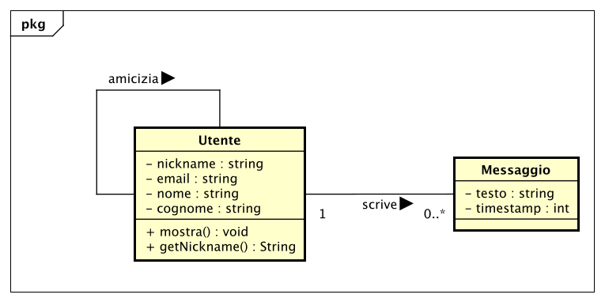
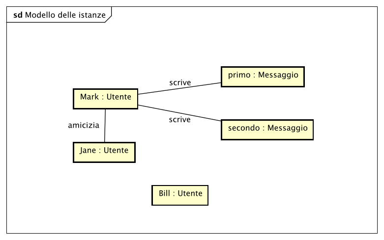

# PoliBook

Cosa facciamo fare a **polibook**?

## Storie

1. Mark si registra e inserisce *email*, *nickname*, *nome reale*
2. Mark scrive un messaggio
3. Mark diventa amico di Jane
3. Jane, essendo amica di Mark, può vedere i suoi messaggi (e viceversa)
3. Mark propone di diventare amico di Bill, il quale ci pensa e rifiuta

## Design

### Concetti base

Classi:
- Utente
    - nickname
    - email
    - nome
    - cognome
	
- Messaggio
    - testo
    - data/ora

Relazione/Associazione
- Amicizia (tra due utenti)

Diagramma delle classi:

Diagramma degli oggetti:

